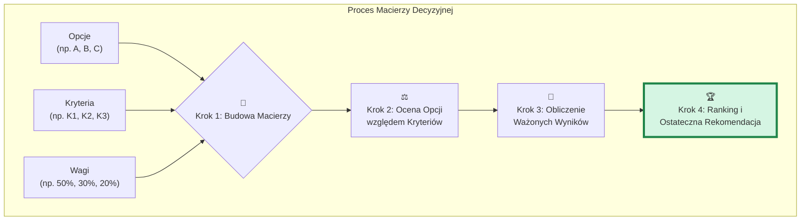

# 🧩 Klocek Koncepcyjny #10: Analiza Kompromisów (Macierz Decyzyjna) [MD]

## 📇 Karta Identyfikacyjna

| Cecha | Wartość |
| :--- | :--- |
| **ID** | KM-010 |
| **Alias** | Macierz Decyzyjna, Analiza Wielokryterialna, Racjonalny Wybór |
| **Typ** | Wzorzec Decyzyjny (Decisive Pattern) |
| **Główne Zadanie** | Podjęcie ustrukturyzowanej, możliwej do obrony i transparentnej decyzji |

## 💡 Opis Koncepcyjny

**Analiza Kompromisów**, najczęściej implementowana jako **Macierz Decyzyjna**, to ostateczne narzędzie do podejmowania racjonalnych decyzji w sytuacjach, gdy żadna z opcji nie jest idealna i trzeba dokonać świadomych kompromisów. Jest to najbardziej sformalizowana i zdyscyplinowana forma Myślenia Zbieżnego.

Głównym celem tej metody jest zwalczanie ludzkich błędów poznawczych, takich jak podejmowanie decyzji w oparciu o emocje, ostatnie informacje czy pojedyncze, dominujące kryterium. Poprzez "uzewnętrznienie" procesu decyzyjnego w formie tabeli, zmuszamy się do jawnego zdefiniowania **co jest dla nas ważne (kryteria)** i **jak bardzo jest to ważne (wagi)**. Proces ten przekształca niejasny, intuicyjny wybór w transparentny, niemal matematyczny proces, którego wynik jest łatwy do zakomunikowania i obrony.

**Zastosowania:**

* **Wybór dostawcy lub technologii:** Porównanie ofert, frameworków programistycznych, dostawców chmury.

* **Priorytetyzacja:** Decydowanie, które funkcje produktu rozwijać w następnej kolejności.

* **Decyzje strategiczne:** Wybór rynku, na który należy wejść, lub strategii inwestycyjnej.

* **Rekrutacja:** Porównanie kandydatów w oparciu o zdefiniowany zestaw kompetencji.

## ⚙️ Struktura Aktywacyjna

Aktywacja wzorca polega na zleceniu AI zbudowania i przeanalizowania macierzy decyzyjnej, która prowadzi do ostatecznej, uzasadnionej rekomendacji.

### Szablon Promptu (Wersja Rozszerzona z Analizą Wrażliwości)

#### PROBLEM DECYZYJNY
{Szczegółowy opis decyzji do podjęcia i kontekstu, np. "Wybór systemu CRM dla małej firmy e-commerce."}

#### ZADANIE
Zastosuj metodę Analizy Kompromisów (Macierz Decyzyjna), aby wybrać najlepszą opcję.

#### INSTRUKCJE WYKONANIA
Postępuj ściśle według następujących kroków:

KROK 1: Zidentyfikuj Opcje. Wymień wszystkie rozważane opcje (np. "Salesforce, HubSpot, Zoho CRM").

KROK 2: Zdefiniuj Kryteria Oceny. Wymień wszystkie kluczowe kryteria, które są istotne dla tej decyzji (np. "Cena", "Łatwość użycia", "Możliwości integracji").

KROK 3: Przypisz Wagi Kryteriom. Określ procentową wagę dla każdego kryterium. Suma wag musi wynosić 100%.

KROK 4: Zbuduj Macierz i Oceń Opcje. Stwórz tabelę. Oceń każdą opcję względem każdego kryterium w skali 1-10 (gdzie 1 = bardzo słabo, 10 = doskonale).

KROK 5: Oblicz Wyniki i Przedstaw Rekomendację. Oblicz ważony wynik dla każdej opcji (wynik = Σ (ocena * waga)). Wskaż opcję z najwyższym wynikiem jako rekomendację i przedstaw uzasadnienie.

KROK 6: Przeprowadź Analizę Wrażliwości. Krótko skomentuj, czy rekomendacja zmieniłaby się, gdyby wagi dwóch najważniejszych kryteriów zostały zamienione miejscami.

## 🌊 Diagram Przepływu Myślowego

Proces ten można zwizualizować jako logiczny przepływ pracy, który przekształca dane wejściowe w ostateczną, uszeregowaną listę opcji.



## 🚧 Anty-wzorce i Pułapki
Siła macierzy decyzyjnej jest również jej słabością – jej racjonalność jest tylko tak dobra, jak dane wejściowe.

"Garbage In, Garbage Out" (GIGO): Najważniejszy anty-wzorzec. Jeśli opcje, kryteria, wagi lub oceny są niekompletne, oparte na uprzedzeniach lub złych danych, cały proces jest tylko fasadą racjonaljonalności, która prowadzi do precyzyjnie obliczonej, ale błędnej decyzji.

Złudzenie Precyzji: Traktowanie końcowych wyników (np. 8.7 vs 8.6) jako absolutnej, obiektywnej prawdy. Macierz jest narzędziem do myślenia i dyskusji o kompromisach, a nie nieomylną wyrocznią. Najważniejsza jest rozmowa o tym, dlaczego dana opcja dostała taką, a nie inną ocenę.

Kryteria Szyte na Miarę: Świadome lub nieświadome dobieranie kryteriów i wag w taki sposób, aby faworyzowały z góry wybraną, "ulubioną" opcję. To zamienia proces decyzyjny w proces szukania uzasadnienia.

## ✅ Pytania Kontrolne Architekta
Zanim podejmiesz ostateczną decyzję na podstawie macierzy, zadaj sobie te pytania:

Czy moje kryteria są od siebie niezależne (ortogonalne)? Czy nie mierzą one w rzeczywistości tej samej rzeczy na różne sposoby, sztucznie zawyżając jej wagę?

Czy zaangażowałem inne perspektywy w definiowanie kryteriów i wag? Aby zredukować własne uprzedzenia, warto skonsultować te elementy z innymi ludźmi lub poprosić AI o odegranie roli "adwokata diabła".

Jak bardzo wrażliwa jest ta decyzja? (Pytanie z analizy wrażliwości). Jeśli niewielka zmiana wag prowadzi do zupełnie innej rekomendacji, oznacza to, że opcje są bardzo zbliżone i decyzja jest trudna.

## 🔗 Relacje i Kombinacje
Synergia:
Jest to najbardziej sformalizowana i "wykonawcza" implementacja wzorca KM-004 (Myślenie Zbieżne).
Opcje do macierzy są idealnie generowane przez KM-003 (Myślenie Rozbieżne).
Kryteria i wagi mogą być wynikiem dogłębnej analizy za pomocą KM-005 (Myślenie Sześcioma Kapeluszami).

Sekwencja:
Jest to wzorzec "kończący" proces analityczno-decyzyjny. Stosuje się go, gdy wszystkie dane i opcje są już na stole.

## 💾 Reprezentacja Systemowa (JSON)

```json
{

  "id": "KM-010",

  "nazwa": "Analiza Kompromisów / Drzewo Decyzyjne (Trade-off Analysis)",

  "alias": ["Macierz Decyzyjna", "Analiza Wielokryterialna", "Racjonalny Wybór"],

  "typ": "Wzorzec Decyzyjny (Decisive Pattern)",

  "cel": "Ustrukturyzowane i racjonalne podejmowanie decyzji poprzez jawną ocenę opcji względem ważonych kryteriów.",

  "zastosowania": [

    "wybór dostawcy/technologii", 

    "priorytetyzacja", 

    "decyzje strategiczne", 

    "rekrutacja"

  ],

  "szablon_promptu_wersja": "2.0",

  "szablon_promptu": "### PROBLEM DECYZYJNY ###\n{opis_decyzji}\n\n### ZADANIE ###\nZastosuj Analizę Kompromisów (Macierz Decyzyjna).\n\n### INSTRUKCJE WYKONANIA ###\n1. Zidentyfikuj Opcje.\n2. Zdefiniuj i przypisz wagi Kryteriom.\n3. Zbuduj Macierz i Oceń Opcje.\n4. Oblicz Wyniki i Przedstaw Rekomendację.\n5. Przeprowadź Analizę Wrażliwości.",

  "relacje": {

    "implementacja_dla": ["KM-004"],

    "wykorzystuje_wyniki_z": ["KM-003", "KM-005"]

  }
```
}

