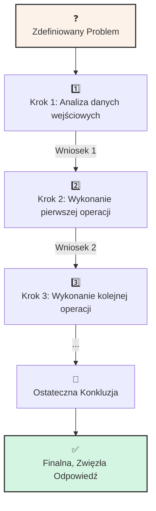

# 🧩 Klocek Koncepcyjny #1: Łańcuch Myśli (Chain-of-Thought)

## 📇 Karta Identyfikacyjna

| Cecha | Wartość |
| :--- | :--- |
| **ID** | KM-001 |
| **Alias** | CoT, Myślenie Krok po Kroku |
| **Typ** | Wzorzec Procesu (Process Pattern) |
| **Główne Zadanie** | Ustrukturyzowanie i spowolnienie procesu wnioskowania |

## 💡 Opis Koncepcyjny

**Łańcuch Myśli (Chain-of-Thought)** to fundamentalny wzorzec, który przekształca sposób, w jaki model językowy podchodzi do problemu. Zamiast próbować "przeskoczyć" od razu od pytania do odpowiedzi, zmuszamy model do **symulowania ludzkiego procesu rozumowania** – krok po kroku, budując argumentację i wykorzystując wnioski z jednego etapu jako dane wejściowe do następnego.

Głównym celem jest zwiększenie **dokładności i logicznej spójności** w zadaniach wieloetapowych. Co równie ważne, proces myślowy staje się **transparentny**. Otrzymujemy nie tylko wynik, ale całą ścieżkę, która do niego doprowadziła, co umożliwia weryfikację, debugowanie i identyfikację błędów w rozumowaniu modelu.

**Zastosowania:**
* **Problemy matematyczne i logiczne:** Rozwiązywanie zadań tekstowych, łamigłówek.
* **Planowanie i Strategia:** Tworzenie planów działania, harmonogramów, analizy scenariuszy.
* **Debugowanie:** Analiza kodu lub logiki w poszukiwaniu błędów.
* **Analiza przyczynowo-skutkowa:** Dochodzenie do źródła problemu.

## ⚙️ Struktura Aktywacyjna

Aktywacja polega na jawnym zażądaniu od modelu, aby przedstawił swój proces myślowy w sekwencyjnej formie, zanim udzieli ostatecznej odpowiedzi.

### Szablon Promptu (Wersja Rozszerzona)

### PROBLEM DO ROZWIĄZANIA

{Szczegółowy opis problemu, zawierający wszystkie niezbędne dane.}

### ZADANIE

Twoim zadaniem jest rozwiązanie powyższego problemu, stosując metodę Łańcucha Myśli (Chain-of-Thought). Chcę zobaczyć Twój pełny proces rozumowania.

### INSTRUKCJE WYKONANIA

1.  **Myśl Krok po Kroku:** Przedstaw swoje rozumowanie w logicznej sekwencji. Używaj nagłówków lub punktów, aby oddzielić poszczególne etapy.
2.  **Uzasadniaj swoje działania:** Tłumacz, dlaczego wykonujesz dany krok i na jakiej podstawie wyciągasz wnioski.
3.  **Oddziel Odpowiedź:** Po zakończeniu pełnej analizy, wyraźnie oznacz sekcję "OSTATECZNA ODPOWIEDŹ" i przedstaw w niej finalny, zwięzły wynik.

🌊 Diagram Przepływu Myślowego
Proces Łańcucha Myśli można zwizualizować jako liniowy, sekwencyjny przepływ, gdzie każdy krok buduje na poprzednim.



## 🚧 Anty-wzorce i Pułapki

Stosowanie CoT, choć potężne, niesie ze sobą ryzyka. Oto najczęstsze błędy:

  * **Błąd Kaskadowy:** Najgroźniejsza pułapka. Jeśli model popełni błąd na wczesnym etapie (np. źle obliczy jedną wartość), całe późniejsze rozumowanie, nawet jeśli logicznie poprawne, będzie oparte na błędnym fundamencie i doprowadzi do złego wyniku.
  * **Halucynacja w Uzasadnieniu:** Model "wymyśla" fałszywy fakt lub regułę na potrzeby jednego z kroków, a następnie konsekwentnie buduje na niej dalszą, pozornie logiczną argumentację.
  * **Zbyt Płytki Łańcuch:** Model tylko udaje, że myśli krok po kroku, w rzeczywistości parafrazując pytanie lub podając oczywiste stwierdzenia, które nie wnoszą nowej wartości analitycznej.

## ✅ Pytania Kontrolne Architekta

Zanim zastosujesz ten klocek, zadaj sobie następujące pytania:

1.  **Czy problem jest wystarczająco złożony?** Stosowanie CoT do prostych zapytań o fakty (np. "Kto napisał 'Lalkę'?") to nadmiar formy nad treścią i strata czasu.
2.  **Czy każdy krok w łańcuchu jest weryfikowalny?** Jeśli widzisz, że model wykonuje "logiczny skok", który jest dla Ciebie niejasny, zażądaj dalszych wyjaśnień tego konkretnego kroku.
3.  **Czy wyraźnie oddzieliłem rozumowanie od odpowiedzi?** Jasne rozdzielenie analizy od wyniku jest kluczowe dla czytelności i późniejszego wykorzystania odpowiedzi w zautomatyzowanych systemach.

## 🔗 Relacje i Kombinacje

  * **Synergia:**
      * `KM-002 (Myślenie od Podstaw)`: CoT jest "silnikiem wykonawczym" do przeprowadzenia procesu dekonstrukcji.
      * `KM-004 (Myślenie Zbieżne)`: CoT może być użyty do transparentnego uzasadnienia, dlaczego dana opcja została wybrana na podstawie określonych kryteriów.
  * **Anty-wzorzec:** Stosowanie go jako zamiennika dla prostego zapytania o fakt. Jeśli potrzebujesz tylko jednej, konkretnej informacji, poproś o nią bezpośrednio.

## 💾 Reprezentacja Systemowa (JSON)

```json
{
  "id": "KM-001",
  "nazwa": "Łańcuch Myśli (Chain-of-Thought - CoT)",
  "alias": ["CoT", "Myślenie Krok po Kroku"],
  "typ": "Wzorzec Procesu (Process Pattern)",
  "cel": "Zwiększenie dokładności i logicznej spójności rozumowania, szczególnie w problemach wymagających wielu kroków. Uczynienie procesu wnioskowania transparentnym i audytowalnym.",
  "zastosowania": [
    "problemy matematyczne", 
    "planowanie", 
    "debugowanie", 
    "analiza przyczynowo-skutkowa"
  ],
  "szablon_promptu_wersja": "2.0",
  "szablon_promptu": "### PROBLEM DO ROZWIĄZANIA ###\n{opis_problemu}\n\n### ZADANIE ###\nTwoim zadaniem jest rozwiązanie powyższego problemu, stosując metodę Łańcucha Myśli (Chain-of-Thought). Chcę zobaczyć Twój pełny proces rozumowania.\n\n### INSTRUKCJE WYKONANIA ###\n1. Myśl Krok po Kroku: Przedstaw swoje rozumowanie w logicznej sekwencji.\n2. Uzasadniaj swoje działania: Tłumacz, dlaczego wykonujesz dany krok.\n3. Oddziel Odpowiedź: Po zakończeniu analizy, wyraźnie oznacz sekcję 'OSTATECZNA ODPOWIEDŹ' i przedstaw w niej finalny, zwięzły wynik.",
  "relacje": {
    "synergia": ["KM-002", "KM-004", "KM-008"]
  }
}
```
