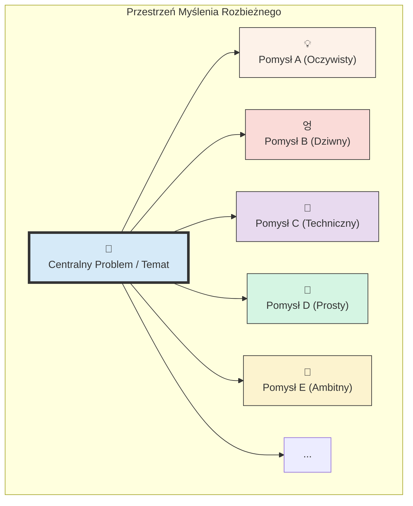

# 🧩 Klocek Koncepcyjny #3: Myślenie Rozbieżne (Divergent Thinking)

## 📇 Karta Identyfikacyjna

| Cecha | Wartość |
| :--- | :--- |
| **ID** | KM-003 |
| **Alias** | Burza Mózgów, Myślenie Kreatywne, Eksploracja |
| **Typ** | Wzorzec Kreatywny (Creative Pattern) |
| **Główne Zadanie** | Wygenerowanie szerokiego spektrum opcji i pomysłów bez oceny |

## 💡 Opis Koncepcyjny

**Myślenie Rozbieżne (Divergent Thinking)** to zdyscyplinowany proces generowania jak największej liczby różnorodnych pomysłów, perspektyw i rozwiązań w odpowiedzi na otwarty problem. Kluczową zasadą jest **świadome zawieszenie oceny**. W tej fazie nie ma złych pomysłów. Celem jest ilość, a nie jakość; eksploracja, a nie wybór.

Jest to fundamentalny mechanizm kreatywności, który pozwala na ucieczkę od utartych ścieżek myślowych i zmapowanie całej przestrzeni możliwych rozwiązań. Poprzez celowe obniżenie barier krytycyzmu, zachęcamy zarówno siebie, jak i model AI do podążania za mniej oczywistymi skojarzeniami, co często prowadzi do przełomowych koncepcji. Jest to pierwszy, niezbędny krok w każdym świadomym procesie twórczym lub decyzyjnym.

**Zastosowania:**

* **Burze mózgów:** Generowanie pomysłów na nowe produkty, kampanie marketingowe, rozwiązania problemów.

* **Proces kreatywny:** Poszukiwanie różnych dróg rozwoju dla projektu artystycznego lub technicznego.

* **Identyfikacja możliwości:** Odkrywanie nowych, nieoczywistych ścieżek rozwoju strategii.

* **Pokonywanie blokad twórczych:** "Zmuszenie" systemu do wyjścia z utartych kolein myślowych.

## ⚙️ Struktura Aktywacyjna

Aktywacja polega na zleceniu generowania szerokiego spektrum opcji przy jednoczesnym jawnym zakazie ich oceniania lub filtrowania.

### Szablon Promptu (Wersja Rozszerzona z Ograniczeniami Kreatywnymi)

TEMAT BURZY MÓZGÓW
{Szczegółowy opis otwartego problemu lub tematu do eksploracji.}

ZADANIE
Zastosuj Myślenie Rozbieżne. Twoim celem jest wygenerowanie listy {liczba} różnorodnych i kreatywnych pomysłów/rozwiązań.

KLUCZOWE ZASADY PROCESU
Ilość ponad Jakość: Skup się na wygenerowaniu jak największej liczby opcji.
Zero Oceny: Absolutny zakaz krytykowania, oceniania czy filtrowania pomysłów na tym etapie.
Dzikie Pomysły Mile Widziane: Zachęcam do proponowania niekonwencjonalnych, odważnych, a nawet absurdalnych koncepcji.
Buduj na Innych Pomysłach: Łącz i modyfikuj wygenerowane wcześniej idee.

(Opcjonalnie) OGRANICZENIA KREATYWNE
Perspektywa: Wygeneruj pomysły z perspektywy {np. dziecka, inżyniera z NASA, historyka z XIX wieku}.
Ograniczenie Zasobów: Wszystkie pomysły muszą być możliwe do zrealizowania przy budżecie {np. poniżej 1000 zł}.

Przedstaw wynik w formie przejrzystej listy punktowanej.

## 🌊 Diagram Przepływu Myślowego

Proces ten można zwizualizować jako eksplozję pomysłów promieniującą z jednego, centralnego punktu.



## 🚧 Anty-wzorce i Pułapki

Myślenie rozbieżne jest skuteczne tylko wtedy, gdy jest prowadzone w zdyscyplinowany sposób. Unikaj tych błędów:
Przedwczesna Ocena: Najczęstszy i najbardziej destrukcyjny błąd. Komentarze typu "to się nie uda", "to jest zbyt drogie" lub "już tego próbowaliśmy" zabijają proces w zarodku.
Dryfowanie od Tematu: Sesja traci fokus, a generowane pomysły stają się całkowicie niezwiązane z pierwotnym problemem. Ważne jest, aby co jakiś czas wracać do centralnego punktu.
Pułapka Oczywistości: Generowanie tylko bezpiecznych, powierzchownych i znanych pomysłów. Prawdziwa wartość myślenia rozbieżnego leży w dotarciu do drugiego i trzeciego rzutu pomysłów, które są znacznie bardziej oryginalne.

## ✅ Pytania Kontrolne Architekta
Przed rozpoczęciem burzy mózgów, sprawdź swoją gotowość:

Czy mój problem jest wystarczająco otwarty? Myślenie rozbieżne nie nadaje się do problemów zamkniętych, które mają jedno poprawne rozwiązanie (np. "ile jest 2+2?").
Czy w moim prompcie jasno zakazałem oceny? To najważniejsza instrukcja, która musi być wyraźnie sformułowana, aby przełączyć model w tryb kreatywny.
Czy mam plan na to, co zrobię z wynikami? Generowanie setek pomysłów bez zaplanowanej Fazy Zbieżnej (KM-004) to tylko produkcja chaosu. Zawsze miej przygotowany kolejny krok.

## 🔗 Relacje i Kombinacje
Synergia / Sekwencja:
KM-004 (Myślenie Zbieżne): To nierozerwalna para. Myślenie rozbieżne jest zawsze pierwszym krokiem, a myślenie zbieżne zawsze drugim. Są jak wdech i wydech w procesie twórczym. Myślenie rozbieżne bez zbieżnego jest bezcelowe.
Paliwo dla Procesu:
KM-007 (Myślenie przez Analogię) lub KM-002 (Myślenie od Podstaw) mogą być doskonałymi "rozgrzewkami" przed sesją myślenia rozbieżnego, dostarczając unikalnych perspektyw i punktów wyjścia.

## 💾 Reprezentacja Systemowa (JSON)

```json
{

  "id": "KM-003",

  "nazwa": "Myślenie Rozbieżne (Divergent Thinking)",

  "alias": ["Burza Mózgów", "Myślenie Kreatywne", "Eksploracja"],

  "typ": "Wzorzec Kreatywny (Creative Pattern)",

  "cel": "Wygenerowanie szerokiego spektrum opcji i pomysłów w odpowiedzi na otwarty problem, przy celowym zawieszeniu oceny.",

  "zastosowania": [

    "burza mózgów", 

    "proces kreatywny", 

    "identyfikacja możliwości", 

    "pokonywanie blokad twórczych"

  ],

  "szablon_promptu_wersja": "2.0",

  "szablon_promptu": "### TEMAT BURZY MÓZGÓW ###\n{opis_problemu}\n\n### ZADANIE ###\nZastosuj Myślenie Rozbieżne. Twoim celem jest wygenerowanie listy {liczba} różnorodnych i kreatywnych pomysłów/rozwiązań.\n\n### KLUCZOWE ZASADY PROCESU ###\n1. Ilość ponad Jakość.\n2. Zero Oceny.\n3. Dzikie Pomysły Mile Widziane.",

  "relacje": {

    "synergia": ["KM-004"],

    "sekwencja_przed": ["KM-004"],

    "paliwo_z": ["KM-002", "KM-007"]

  }

}
```
