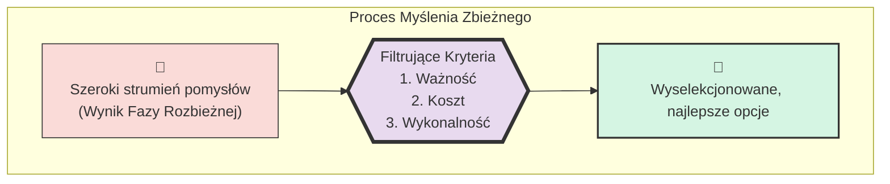

# 🧩 Klocek Koncepcyjny #4: Myślenie Zbieżne (Convergent Thinking)

## 📇 Karta Identyfikacyjna

| Cecha | Wartość |
| :--- | :--- |
| **ID** | KM-004 |
| **Alias** | Selekcja, Filtrowanie, Priorytetyzacja, Ocena |
| **Typ** | Wzorzec Analityczno-Decyzyjny (Analytical-Decisive Pattern) |
| **Główne Zadanie** | Wybór najlepszych opcji na podstawie zdefiniowanych kryteriów |

## 💡 Opis Koncepcyjny

**Myślenie Zbieżne (Convergent Thinking)** to logiczny i zdyscyplinowany proces oceny, filtrowania i syntezy szerokiego wachlarza pomysłów w celu wyboru jednego lub kilku najlepszych rozwiązań. Jest to niezbędny odpowiednik i dopełnienie Myślenia Rozbieżnego. Podczas gdy tamten wzorzec otwierał drzwi do nieskończonych możliwości, Myślenie Zbieżne sprowadza nas z powrotem na ziemię, zmuszając do podjęcia racjonalnej, możliwej do obrony decyzji.

Siła tego wzorca nie leży w intuicji, lecz w **jakości i precyzji zdefiniowanych kryteriów oceny**. To one działają jak sita, które oddzielają ziarno od plew. Proces ten przekształca chaotyczną listę pomysłów w uporządkowany, priorytetyzowany plan działania. Jest to faza, w której kreatywność spotyka się z rzeczywistością.

**Zastosowania:**

* **Podejmowanie decyzji:** Wybór najlepszej strategii, technologii czy kandydata.

* **Priorytetyzacja:** Ustalanie kolejności zadań, funkcji w produkcie (backlog grooming).

* **Synteza informacji:** Redukcja dużej ilości danych do kluczowych wniosków.

* **Ocena ryzyka:** Filtrowanie pomysłów pod kątem ich potencjalnych wad i zagrożeń.

## ⚙️ Struktura Aktywacyjna

Aktywacja polega na dostarczeniu listy opcji oraz, co kluczowe, precyzyjnego zestawu kryteriów, według których ma nastąpić ocena i selekcja.

### Szablon Promptu (Wersja Zaawansowana z Ważonymi Kryteriami)

ZESTAW OPCJI DO OCENY
{Wklejona lista pomysłów wygenerowana np. w fazie Myślenia Rozbieżnego.}

ZADANIE
Zastosuj Myślenie Zbieżne, aby wybrać {liczba} najlepszych opcji z powyższej listy. Twoim zadaniem jest przeprowadzenie racjonalnej i transparentnej oceny.

KRYTERIA OCENY (uporządkowane wg ważności)
{Nazwa Kryterium 1} (Waga: {np. 40%}): {Dokładny opis, co oznacza to kryterium}.

{Nazwa Kryterium 2} (Waga: {np. 30%}): {Dokładny opis, co oznacza to kryterium}.

{Nazwa Kryterium 3} (Waga: {np. 20%}): {Dokładny opis, co oznacza to kryterium}.

{Nazwa Kryterium 4} (Waga: {np. 10%}): {Dokładny opis, co oznacza to kryterium}.

INSTRUKCJE WYKONANIA
Oceń Każdą Opcję: Krótko przeanalizuj każdą z opcji w kontekście podanych kryteriów.
Przedstaw Wybór: Wylistuj {liczba} najlepszych opcji.
Uzasadnij Decyzję: Dla każdej wybranej opcji przedstaw zwięzłe uzasadnienie, odnosząc się bezpośrednio do tego, jak spełnia ona najważniejsze kryteria.

## 🌊 Diagram Przepływu Myślowego

Proces ten najlepiej wizualizuje metafora lejka (funnel), który filtruje liczne możliwości, pozostawiając tylko te najbardziej wartościowe.



## 🚧 Anty-wzorce i Pułapki
Niewłaściwie przeprowadzone Myślenie Zbieżne może zniszczyć wartość wygenerowaną w fazie rozbieżnej. Oto pułapki:

Niejasne lub Subiektywne Kryteria: To najczęstszy błąd. Używanie kryteriów takich jak "musi być fajne" lub "ma być innowacyjne" prowadzi do arbitralnych decyzji. Dobre kryterium jest specyficzne i, jeśli to możliwe, mierzalne (np. "koszt wdrożenia poniżej X", "zwiększa retencję użytkowników o Y%").
Zakochanie się w Pierwszym Pomysle: Tendencja do nieświadomego faworyzowania jednego z pomysłów (często pierwszego lub własnego) i dopasowywania oceny, aby uzasadnić jego wybór, zamiast pozwolić kryteriom prowadzić proces.
Paraliż przez Analizę: Zbyt wiele opcji i zbyt wiele kryteriów mogą prowadzić do przeciążenia informacyjnego i niemożności podjęcia jakiejkolwiek decyzji. Czasem konieczne jest przeprowadzenie selekcji w kilku rundach.

## ✅ Pytania Kontrolne Architekta
Zanim zaczniesz filtrować pomysły, zadaj sobie te pytania:

Czy moje kryteria są kompletne i dobrze zdefiniowane? Czy odzwierciedlają one rzeczywiste cele i ograniczenia projektu? Czy są zrozumiałe dla kogoś z zewnątrz?
Czy wagi kryteriów są adekwatne? Czy najważniejsze kryterium rzeczywiście ma największy wpływ na ostateczną ocenę?
Czy faza rozbieżna była wystarczająco szeroka? Upewnij się, że nie wybierasz "najlepszego pomysłu ze słabej grupy". Jeśli pula wejściowa jest niska, wynik również będzie niski, niezależnie od jakości procesu selekcji.

## 🔗 Relacje i Kombinacje
Synergia / Sekwencja:
KM-003 (Myślenie Rozbieżne): Nierozłączna para. Myślenie Zbieżne jest zawsze drugim krokiem, następującym bezpośrednio po Myśleniu Rozbieżnym.
KM-010 (Analiza Kompromisów): Myślenie Zbieżne jest "silnikiem" dla Analizy Kompromisów. KM-010 to po prostu bardziej sformalizowana i zmatematyzowana implementacja tego wzorca.
Źródło Kryteriów:
KM-005 (Myślenie Sześcioma Kapeluszami): Analiza z perspektywy Czarnego Kapelusza (ryzyka) i Żółtego Kapelusza (korzyści) może być doskonałym źródłem kryteriów do późniejszej oceny.

## 💾 Reprezentacja Systemowa (JSON)

```json
{

  "id": "KM-004",

  "nazwa": "Myślenie Zbieżne (Convergent Thinking)",

  "alias": ["Selekcja", "Filtrowanie", "Priorytetyzacja", "Ocena"],

  "typ": "Wzorzec Analityczno-Decyzyjny (Analytical-Decisive Pattern)",

  "cel": "Systematyczna ocena, filtrowanie i synteza pomysłów w celu zidentyfikowania jednego, najlepszego rozwiązania w oparciu o zdefiniowane kryteria.",

  "zastosowania": [

    "podejmowanie decyzji", 

    "priorytetyzacja", 

    "wybór strategii", 

    "synteza informacji"

  ],

  "szablon_promptu_wersja": "2.0",

  "szablon_promptu": "### ZESTAW OPCJI DO OCENY ###\n{lista_opcji}\n\n### ZADANIE ###\nZastosuj Myślenie Zbieżne, aby wybrać {liczba} najlepszych opcji.\n\n### KRYTERIA OCENY (uporządkowane wg ważności) ###\n1. {Kryterium 1} (Waga: X%)\n2. {Kryterium 2} (Waga: Y%)\n\n### INSTRUKCJE WYKONANIA ###\n1. Oceń Każdą Opcję.\n2. Przedstaw Wybór.\n3. Uzasadnij Decyzję.",

  "relacje": {

    "synergia": ["KM-003", "KM-010", "KM-005"],

    "sekwencja_po": ["KM-003"]

  }

}
```
