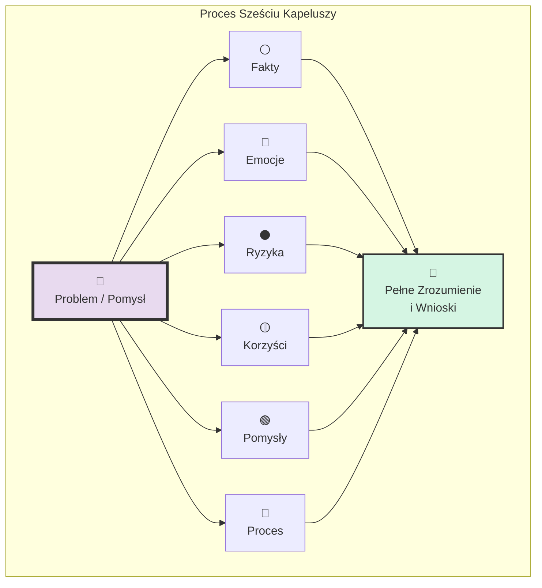

# 🧩 Klocek Koncepcyjny #5: Myślenie Sześcioma Kapeluszami

## 📇 Karta Identyfikacyjna

| Cecha | Wartość |
| :--- | :--- |
| **ID** | KM-005 |
| **Alias** | Metoda De Bono, Myślenie Równoległe, Analiza Wieloperspektywiczna |
| **Typ** | Wzorzec Analityczno-Strukturalny (Analytical-Structural Pattern) |
| **Główne Zadanie** | Uporządkowanie dyskusji przez rozdzielenie perspektyw myślowych |

## 💡 Opis Koncepcyjny

**Myślenie Sześcioma Kapeluszami**, stworzone przez Edwarda de Bono, to rewolucyjna metoda strukturyzacji procesu myślowego. Jej geniusz polega na zastąpieniu tradycyjnej, konfrontacyjnej dyskusji (gdzie uczestnicy bronią swoich stanowisk) **myśleniem równoległym**. Wszyscy uczestnicy (w tym przypadku Ty i AI) w tym samym momencie "zakładają" ten sam metaforyczny kapelusz i spoglądają na problem z tej samej, jednej perspektywy.

To proste narzędzie pozwala w zdyscyplinowany sposób przeanalizować temat z każdej możliwej strony, zapewniając, że żaden kluczowy aspekt – od twardych danych, przez emocje, aż po ryzyka i nowe pomysły – nie zostanie pominięty. Jest to ostateczne narzędzie do prowadzenia uporządkowanej, holistycznej i wolnej od ego analizy.

**Zastosowania:**

* **Kompleksowa analiza problemów:** Dogłębne zrozumienie dowolnego zagadnienia.

* **Ocena pomysłów i strategii:** Zważenie wszystkich "za" i "przeciw" w ustrukturyzowany sposób.

* **Prowadzenie spotkań i dyskusji:** Uporządkowanie chaosu i zapewnienie, że każdy głos zostanie wysłuchany w odpowiednim kanale.

* **Podejmowanie decyzji w grupie:** Budowanie konsensusu poprzez wspólną, równoległą eksplorację tematu.

## ⚙️ Struktura Aktywacyjna

Aktywacja polega na zleceniu AI przeprowadzenia analizy problemu kolejno z perspektywy każdego z sześciu kapeluszy. Kluczem jest ścisłe trzymanie się roli przypisanej do danego koloru.

### Szablon Promptu (Wersja Rozszerzona z Sugerowaną Sekwencją)

#### TEMAT DO ANALIZY
{Szczegółowy opis problemu, pomysłu lub decyzji do podjęcia.}

#### ZADANIE
Zastosuj metodę Myślenia Sześcioma Kapeluszami, aby przeprowadzić pełną i uporządkowaną analizę powyższego tematu. Przeanalizuj go po kolei, ściśle trzymając się roli każdego z kapeluszy.

#### INSTRUKCJE WYKONANIA (Sugerowana Sekwencja)
Przedstaw swoją analizę w następującej kolejności:

🔵 Kapelusz Niebieski (Meta-Proces): Na początku krótko zdefiniuj cel tej analizy i plan działania.

⚪️ Kapelusz Biały (Fakty i Dane): Przedstaw wyłącznie obiektywne, weryfikowalne fakty, dane, liczby i dostępne informacje dotyczące tematu. Powstrzymaj się od jakiejkolwiek interpretacji.

🟢 Kapelusz Zielony (Kreatywność i Pomysły): Wygeneruj nowe, kreatywne pomysły, alternatywy i niekonwencjonalne podejścia do tematu. Nie oceniaj ich.

🟡 Kapelusz Żółty (Korzyści i Optymizm): Wskaż wszystkie potencjalne korzyści, zalety, pozytywne aspekty i szanse związane z pomysłami lub tematem.

⚫️ Kapelusz Czarny (Ryzyka i Przestrogi): Zidentyfikuj wszystkie potencjalne problemy, ryzyka, słabości, zagrożenia i negatywne konsekwencje. Bądź konstruktywnym krytykiem.

🔴 Kapelusz Czerwony (Emocje i Intuicja): Wyraź intuicje, przeczucia i emocjonalne reakcje (np. entuzjazm, obawa, niepokój) bez potrzeby ich racjonalnego uzasadniania.

🔵 Kapelusz Niebieski (Podsumowanie i Wnioski): Na końcu podsumuj całą analizę, wskaż kluczowe wnioski i zaproponuj następne kroki.

## 🌊 Diagram Przepływu Myślowego

Proces ten wizualizuje problem jako centralny obiekt, który jest oświetlany z sześciu różnych, równoległych kierunków, co daje pełny, trójwymiarowy obraz.


## 🚧 Anty-wzorce i Pułapki
Wartość tej metody leży w jej dyscyplinie. Najczęstsze błędy niszczą tę dyscyplinę:

Mieszanie Kapeluszy: Absolutnie najczęstszy błąd. Ktoś w Białym Kapeluszu (fakty) zaczyna wyrażać swoje obawy (Czarny Kapelusz) lub proponować pomysły (Zielony Kapelusz). To prowadzi z powrotem do chaotycznej dyskusji, której metoda miała zapobiec.
Karykatura Zamiast Analizy: Powierzchowne traktowanie ról. Czarny Kapelusz staje się bezmyślnym narzekaniem, a nie konstruktywną oceną ryzyka. Czerwony Kapelusz to wybuch emocji, a nie próba uchwycenia ważnej intuicji. Żółty Kapelusz to naiwny optymizm, a nie poszukiwanie realnych korzyści.
Paraliż przez Proces: Stosowanie tej rozbudowanej metody do prostych, trywialnych problemów, gdzie szybsza byłaby prosta lista "za i przeciw". Narzędzie musi być dopasowane do skali problemu.

## ✅ Pytania Kontrolne Architekta
Zanim rozpoczniesz sesję Sześciu Kapeluszy, zadaj sobie te pytania:

Czy problem jest wystarczająco złożony? Czy ma wiele aspektów (fakty, emocje, ryzyka, korzyści), które warto uporządkować? Jeśli nie, metoda może być przerostem formy nad treścią.
Czy jasno zdefiniowałem cel analizy? Co chcę osiągnąć na koniec tej sesji? (np. podjąć decyzję, zrozumieć problem, wygenerować plan działania). To zadanie dla pierwszego, Niebieskiego Kapelusza.
Czy jestem gotów zdyscyplinowanie podążać za tą strukturą? Sukces metody zależy od Twojej woli, by nie "mieszać kapeluszy" i w pełni wejść w każdą z sześciu ról myślowych, nawet jeśli któraś jest sprzeczna z Twoim naturalnym stylem.

## 🔗 Relacje i Kombinacje

#### Synergia:
KM-003 (Myślenie Rozbieżne): Sesja w 🟢 Zielonym Kapeluszu to idealny moment na zastosowanie pełnej mocy Myślenia Rozbieżnego.
KM-004 (Myślenie Zbieżne): Informacje zebrane pod 🟡 Żółtym Kapeluszem (korzyści) i ⚫️ Czarnym Kapeluszem (ryzyka) stanowią doskonały materiał do zdefiniowania kryteriów dla późniejszego Myślenia Zbieżnego.

#### Alternatywa:
Jest to znacznie bardziej zaawansowana i kompletna alternatywa dla prostej, nieustrukturyzowanej burzy mózgów lub standardowej analizy SWOT.
💾 Reprezentacja Systemowa (JSON)

```json
{

  "id": "KM-005",

  "nazwa": "Myślenie Sześcioma Kapeluszami (Six Thinking Hats)",

  "alias": ["Metoda De Bono", "Myślenie Równoległe", "Analiza Wieloperspektywiczna"],

  "typ": "Wzorzec Analityczno-Strukturalny (Analytical-Structural Pattern)",

  "cel": "Ustrukturyzowanie procesu myślowego poprzez rozdzielenie go na sześć odrębnych, równoległych kanałów (perspektyw).",

  "zastosowania": [

    "analiza problemów", 

    "podejmowanie decyzji", 

    "prowadzenie spotkań", 

    "ocena pomysłów"

  ],

  "szablon_promptu_wersja": "2.0",

  "szablon_promptu": "### TEMAT DO ANALIZY ###\n{opis_problemu}\n\n### ZADANIE ###\nZastosuj metodę Myślenia Sześcioma Kapeluszami.\n\n### INSTRUKCJE WYKONANIA ###\nPrzeanalizuj temat kolejno z perspektywy kapeluszy: Niebieskiego (cel), Białego (fakty), Zielonego (pomysły), Żółtego (korzyści), Czarnego (ryzyka), Czerwonego (emocje) i ponownie Niebieskiego (wnioski).",

  "relacje": {

    "zawiera_w_sobie": ["KM-003"],

    "dostarcza_danych_dla": ["KM-004", "KM-010"],

    "alternatywa_dla": ["nieustrukturyzowana dyskusja", "analiza SWOT"]

  }

}
```
