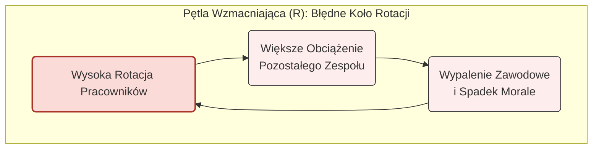

# 🧩 Klocek Koncepcyjny #6: Myślenie Systemowe (Systems Thinking)

## 📇 Karta Identyfikacyjna

| Cecha | Wartość |
| :--- | :--- |
| **ID** | KM-006 |
| **Alias** | Myślenie Holistyczne, Analiza Sprzężeń Zwrotnych, Perspektywa 10 000 stóp |
| **Typ** | Wzorzec Analityczno-Strategiczny (Analytical-Strategic Pattern) |
| **Główne Zadanie** | Zrozumienie złożonych zależności i znalezienie punktów o największej dźwigni |

## 💡 Opis Koncepcyjny

**Myślenie Systemowe** to fundamentalna zmiana perspektywy: od analizowania pojedynczych "drzew" do rozumienia całego "lasu". Zamiast postrzegać problemy jako liniowy ciąg przyczyn i skutków, uczymy się widzieć je jako złożone sieci wzajemnie połączonych elementów. Kluczem jest zrozumienie **relacji** między komponentami, a nie tylko samych komponentów.

W sercu myślenia systemowego leżą dwa kluczowe pojęcia:

1.  **Pętle Sprzężeń Zwrotnych (Feedback Loops):** Silniki napędzające system. Mogą być **wzmacniające** (np. efekt kuli śnieżnej, gdzie sukces rodzi sukces) lub **równoważące** (np. termostat, który stabilizuje temperaturę).

2.  **Właściwości Emergentne (Emergent Properties):** Zachowania i cechy, które wyłaniają się z interakcji części, a których nie posiada żadna z części z osobna (np. świadomość wynikająca z interakcji neuronów).

Celem jest znalezienie prawdziwych, często ukrytych, przyczyn problemów i zidentyfikowanie **punktów dźwigni (leverage points)** – miejsc, w których niewielka, precyzyjna interwencja może przynieść ogromną, pozytywną zmianę w całym systemie.

**Zastosowania:**

* **Analiza organizacyjna:** Zrozumienie, dlaczego działy ze sobą nie współpracują lub dlaczego rotacja jest wysoka.

* **Planowanie strategiczne:** Przewidywanie długofalowych skutków decyzji biznesowych.

* **Zarządzanie zmianą:** Identyfikacja potencjalnego oporu i nieoczekiwanych konsekwencji.

* **Analiza problemów społecznych i rynkowych:** Modelowanie złożonych interakcji, np. między popytem a podażą.

## ⚙️ Struktura Aktywacyjna

Aktywacja wzorca polega na zleceniu AI przeprowadzenia zdyscyplinowanej analizy problemu przez pryzmat teorii systemów.

### Szablon Promptu (Wersja Rozszerzona)

#### SYSTEM DO ANALIZY
{Szczegółowy opis problemu, organizacji lub zjawiska, które chcemy zrozumieć.}

#### ZADANIE
Zastosuj Myślenie Systemowe, aby dogłębnie przeanalizować ten problem. Twoim celem jest stworzenie mapy systemu, zidentyfikowanie kluczowych dynamik i wskazanie najbardziej obiecujących punktów interwencji.

#### INSTRUKCJE WYKONANIA
Postępuj ściśle według następujących kroków:

KROK 1: Zdefiniuj Granice Systemu. Określ, co znajduje się wewnątrz analizowanego systemu, a co jest jego otoczeniem zewnętrznym.

KROK 2: Zidentyfikuj Kluczowe Komponenty. Wymień najważniejsze elementy, aktorów, zasoby i zmienne wewnątrz systemu.

KROK 3: Zmapuj Relacje i Wpływy. Opisz, jak zidentyfikowane komponenty wpływają na siebie nawzajem (np. "Wzrost X powoduje spadek Y").

KROK 4: Zidentyfikuj Pętle Sprzężeń Zwrotnych. Znajdź i opisz co najmniej jedną pętlę wzmacniającą (R) i jedną pętlę równoważącą (B).

KROK 5: Wskaż Punkty Dźwigni (Leverage Points). Na podstawie analizy wskaż 1-2 miejsca, w których interwencja przyniosłaby największy pozytywny efekt w całym systemie.

## 🌊 Diagram Przepływu Myślowego

Myślenie systemowe najlepiej wizualizują diagramy pętli przyczynowych (Causal Loop Diagrams). Oto przykład paradygmatyczny dla problemu rotacji w zespole.



## 🚧 Anty-wzorce i Pułapki
To potężna metoda, ale łatwo wpaść w pułapkę nadmiernej komplikacji. Unikaj tych błędów:

Utopienie w Złożoności: Próba zmapowania absolutnie każdego elementu i każdej relacji. Prowadzi to do stworzenia diagramu tak skomplikowanego, że staje się bezużyteczny. Sztuka polega na znalezieniu odpowiedniego poziomu abstrakcji.
Myślenie Liniowe w Przebraniu: Tworzenie mapy, która jest tylko prostym schematem blokowym (flowchart) bez żadnych pętli sprzężeń zwrotnych. Ominięcie pętli to ominięcie całej istoty myślenia systemowego.
Szukanie Winnych: Myślenie systemowe uczy, że problemy często wynikają ze struktury systemu, a nie ze złej woli poszczególnych jego elementów. Obwinianie konkretnej osoby lub działu zamiast analizy pętli, które wymuszają ich zachowanie, to fundamentalne niezrozumienie tej metody.

## ✅ Pytania Kontrolne Architekta
Przed głębokim zanurzeniem w analizę systemową, sprawdź swoje przygotowanie:

Czy poprawnie zdefiniowałem granice systemu? Co świadomie włączam do analizy, a co (na razie) pomijam? Czy ta granica ma sens?
Czy zidentyfikowałem przynajmniej jedną pętlę sprzężenia zwrotnego? Jeśli widzisz tylko jednokierunkowe strzałki, prawdopodobnie wciąż myślisz liniowo, a nie systemowo.
Czy moja analiza prowadzi do znalezienia punktu dźwigni? Celem nie jest tylko opisanie systemu, ale znalezienie miejsca, w którym można go skutecznie zmienić. Czy Twoja analiza zbliża Cię do tego celu?

## 🔗 Relacje i Kombinacje

#### Synergia:
KM-009 (Planowanie Scenariuszowe): Analiza systemowa jest niezbędna do zidentyfikowania kluczowych "sił napędowych", które stają się osiami w planowaniu scenariuszowym.

KM-008 (Analiza Przyczyn Źródłowych): Może być użyta do "przybliżenia" i zbadania jednej, konkretnej ścieżki przyczynowo-skutkowej, którą odkryliśmy na naszej mapie systemu.

#### Alternatywa:
Jest to bezpośrednia alternatywa dla prostszej, liniowej analizy przyczynowo-skutkowej (KM-008), stosowana, gdy problem jest złożony, dynamiczny i nieliniowy.

## 💾 Reprezentacja Systemowa (JSON)

```json
{

  "id": "KM-006",

  "nazwa": "Myślenie Systemowe (Systems Thinking)",

  "alias": ["Myślenie Holistyczne", "Analiza Sprzężeń Zwrotnych"],

  "typ": "Wzorzec Analityczno-Strategiczny (Analytical-Strategic Pattern)",

  "cel": "Analiza problemów jako złożonych systemów, skupiając się na relacjach, pętlach sprzężeń zwrotnych i właściwościach emergentnych w celu znalezienia efektywnych punktów interwencji.",

  "zastosowania": [

    "analiza organizacyjna", 

    "planowanie strategiczne", 

    "zarządzanie zmianą", 

    "analiza rynkowa"

  ],

  "szablon_promptu_wersja": "2.0",

  "szablon_promptu": "### SYSTEM DO ANALIZY ###\n{opis_problemu}\n\n### ZADANIE ###\nZastosuj Myślenie Systemowe.\n\n### INSTRUKCJE WYKONANIA ###\n1. Zdefiniuj Granice Systemu.\n2. Zidentyfikuj Kluczowe Komponenty.\n3. Zmapuj Relacje i Wpływy.\n4. Zidentyfikuj Pętle Sprzężeń Zwrotnych.\n5. Wskaż Punkty Dźwigni.",

  "relacje": {

    "dostarcza_danych_dla": ["KM-009"],

    "wykorzystuje_w_srodku": ["KM-008"],

    "alternatywa_dla": ["KM-008 (dla złożonych problemów)"]

  }

}
```
