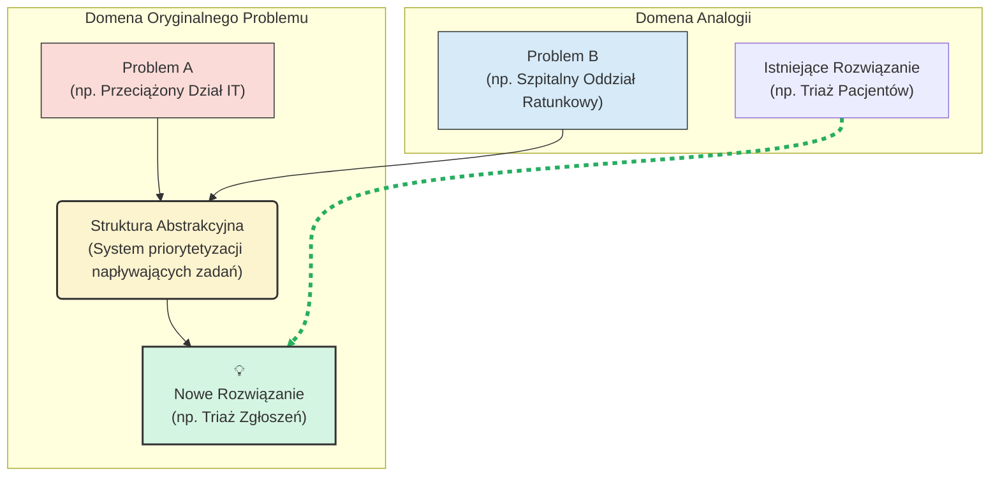

# 🧩 Klocek Koncepcyjny #7: Myślenie przez Analogię

## 📇 Karta Identyfikacyjna

| Cecha | Wartość |
| :--- | :--- |
| **ID** | KM-007 |
| **Alias** | Myślenie Metaforyczne, Transfer Wiedzy, Zapłodnienie Krzyżowe |
| **Typ** | Wzorzec Kreatywny (Creative Pattern) |
| **Główne Zadanie** | Rozwiązywanie problemów przez adaptację rozwiązań z odległych dziedzin |

## 💡 Opis Koncepcyjny

**Myślenie przez Analogię** to fundamentalna zdolność poznawcza polegająca na rozwiązywaniu nowego problemu poprzez znalezienie i adaptację rozwiązania z innej, lepiej zrozumianej dziedziny. Jest to prawdopodobnie domyślny, najbardziej naturalny tryb ludzkiej kreatywności. Zamiast wymyślać rozwiązanie od zera, zadajemy sobie pytanie: "Gdzie indziej w świecie istnieje problem o podobnej strukturze i jak tam został rozwiązany?".

Kluczem do mistrzostwa w tej technice jest wyjście poza **analogie powierzchowne** (rzeczy, które *wyglądają* podobnie) i odnalezienie **analogii strukturalnych** (rzeczy, które *działają* podobnie). Gdy Johannes Gutenberg połączył ideę prasy do wina z wybijaniem monet, stworzył prasę drukarską – to jest właśnie myślenie przez analogię w akcji. Celem jest "zapłodnienie krzyżowe" (cross-pollination) idei między pozornie niezwiązanymi ze sobą domenami, aby przełamać impas i znaleźć innowacyjne rozwiązania.

**Zastosowania:**

* **Innowacje i rozwiązywanie problemów:** Znajdowanie gotowych "szablonów" rozwiązań w naturze, technice czy historii.

* **Wyjaśnianie złożonych pojęć:** Tłumaczenie trudnych koncepcji za pomocą prostszych, bardziej zrozumiałych metafor (np. "gen to przepis kulinarny").

* **Przełamywanie blokad myślowych:** Kiedy utkniesz, zmiana domeny i poszukiwanie analogii może natychmiast odblokować nowe ścieżki myślenia.

* **Transfer wiedzy:** Adaptowanie sprawdzonych procesów z jednej branży do drugiej.

## ⚙️ Struktura Aktywacyjna

Aktywacja wzorca polega na przeprowadzeniu modelu przez zdyscyplinowany, czteroetapowy proces abstrakcji, poszukiwania i adaptacji.

### Szablon Promptu (Wersja Rozszerzona)

#### ORYGINALNY PROBLEM DO ROZWIĄZANIA
{Szczegółowy opis problemu, w którym utknęliśmy.}

#### ZADANIE
Zastosuj Myślenie przez Analogię, aby znaleźć innowacyjne rozwiązanie tego problemu. Celem jest znalezienie inspiracji w odległej dziedzinie i zaadaptowanie jej do naszego kontekstu.

#### INSTRUKCJE WYKONANIA
Postępuj ściśle według następujących kroków:

KROK 1: Uchwycenie Esencji Problemu. Opisz fundamentalną strukturę lub dynamikę problemu w jednym, abstrakcyjnym zdaniu. (np. "Potrzebujemy systemu, który efektywnie dystrybuuje ograniczone zasoby do wielu punktów o zmiennym priorytecie").

KROK 2: Podróż po Inspiracje. Wymień 3-5 odległych, nieoczywistych dziedzin (np. biologia, wojskowość, logistyka portowa, gry komputerowe), w których występuje problem o podobnej, abstrakcyjnej strukturze.

KROK 3: Wybór i Analiza Najlepszej Mapy. Wybierz jedną, najbardziej obiecującą analogię. Opisz szczegółowo, jak problem jest rozwiązywany w tej analogicznej domenie.

KROK 4: Tłumaczenie Mapy na Rozwiązanie. Przełóż (zaadaptuj) rozwiązanie z analogicznej domeny na konkretne, możliwe do wdrożenia działania w kontekście oryginalnego problemu.

## 🌊 Diagram Przepływu Myślowego

Proces ten wizualizuje transfer struktury rozwiązania z jednej domeny (źródłowej) do drugiej (docelowej) poprzez most abstrakcji.



## 🚧 Anty-wzorce i Pułapki
Myślenie przez analogię, choć naturalne, jest podatne na błędy poznawcze. Unikaj ich:

Analogia Powierzchowna: Najczęstszy błąd. Wybór analogii oparty na powierzchownych cechach (np. "firma jest jak statek, bo ma kapitana-CEO"), a nie na głębokiej, funkcjonalnej strukturze problemu. Taka analogia jest bezużyteczna i prowadzi do błędnych wniosków.

Niewolnicze Kopiowanie: Próba przeniesienia rozwiązania z innej domeny w skali 1:1, bez uwzględnienia unikalnych ograniczeń i kontekstu oryginalnego problemu. Celem jest adaptacja i inspiracja, a nie ślepe kopiowanie.

Pierwsza Lepsza Analogia: Zatrzymanie się na pierwszej analogii, która przyjdzie do głowy. Największą wartość przynoszą często analogie odległe i nieoczywiste, które wymagają większego wysiłku umysłowego, by je znaleźć.

## ✅ Pytania Kontrolne Architekta
Zanim zaczniesz budować mosty między domenami, zadaj sobie te pytania:

Czy moja analogia opiera się na głębokiej strukturze ("jak to działa"), czy tylko na powierzchowności ("jak to wygląda")?

Które elementy z analogii mogę przenieść, a które muszę świadomie odrzucić lub zmodyfikować, aby pasowały do mojego kontekstu?

Czy rozważyłem co najmniej trzy różne, odległe analogie? Nie poprzestawaj na pierwszej, która przyjdzie Ci do głowy. Zmuś siebie i AI do większej kreatywności.

## 🔗 Relacje i Kombinacje

Synergia:
KM-003 (Myślenie Rozbieżne): Myślenie przez analogię jest jednym z najpotężniejszych paliw dla fazy rozbieżnej. Każda nowa, odległa analogia może otworzyć zupełnie nowy wszechświat potencjalnych rozwiązań.
Napięcie / Równowaga:

KM-002 (Myślenie od Podstaw): To dwa przeciwstawne bieguny kreatywności. Myślenie przez analogię korzysta z istniejących wzorców, podczas gdy myślenie od podstaw stara się je zniszczyć i zbudować wszystko od nowa. Użycie ich razem (np. znalezienie analogii, a potem zdekonstruowanie jej do pierwszych zasad) to niezwykle potężna technika.

## 💾 Reprezentacja Systemowa (JSON)

```json
{

  "id": "KM-007",

  "nazwa": "Myślenie przez Analogię (Analogical Reasoning)",

  "alias": ["Myślenie Metaforyczne", "Transfer Wiedzy", "Zapłodnienie Krzyżowe"],

  "typ": "Wzorzec Kreatywny (Creative Pattern)",

  "cel": "Rozwiązywanie nowych problemów poprzez znalezienie i adaptację rozwiązania z innej, lepiej zrozumianej dziedziny o podobnej strukturze.",

  "zastosowania": [

    "innowacje", 

    "wyjaśnianie pojęć", 

    "przełamywanie blokad myślowych", 

    "transfer wiedzy"

  ],

  "szablon_promptu_wersja": "2.0",

  "szablon_promptu": "### ORYGINALNY PROBLEM DO ROZWIĄZANIA ###\n{opis_problemu}\n\n### ZADANIE ###\nZastosuj Myślenie przez Analogię, aby znaleźć innowacyjne rozwiązanie.\n\n### INSTRUKCJE WYKONANIA ###\n1. Uchwycenie Esencji Problemu.\n2. Podróż po Inspiracje (znajdź 3-5 odległych domen).\n3. Wybór i Analiza Najlepszej Mapy.\n4. Tłumaczenie Mapy na Rozwiązanie.",

  "relacje": {

    "paliwo_dla": ["KM-003"],

    "alternatywa_dla": ["KM-002"]

  }

}
```
