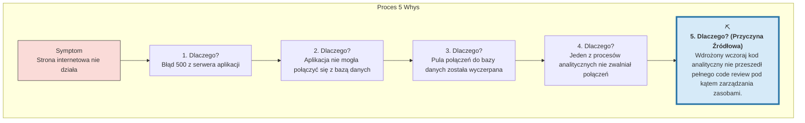

# 🧩 Klocek Koncepcyjny #8: Analiza Przyczyn Źródłowych (5 Whys)

## 📇 Karta Identyfikacyjna

| Cecha | Wartość |
| :--- | :--- |
| **ID** | KM-008 |
| **Alias** | 5xDlaczego, RCA (Root Cause Analysis), Myślenie Wertykalne |
| **Typ** | Wzorzec Diagnostyczny (Diagnostic Pattern) |
| **Główne Zadanie** | Dotarcie do fundamentalnej przyczyny problemu, a nie jego symptomów |

## 💡 Opis Koncepcyjny

**Analiza Przyczyn Źródłowych (Root Cause Analysis)**, w swojej najprostszej i najbardziej eleganckiej formie znanej jako **Metoda 5 Whys**, to technika diagnostyczna wywodząca się z Toyota Production System. Jej siła tkwi w zwodniczej prostocie: poprzez iteracyjne zadawanie pytania "Dlaczego?" w odpowiedzi na problem, zmuszamy się do zejścia poniżej poziomu oczywistych symptomów i dotarcia do fundamentalnej, często ukrytej, przyczyny.

Celem jest przesunięcie uwagi z **"KTO popełnił błąd?"** na **"DLACZEGO proces pozwolił na popełnienie tego błędu?"**. To kluczowa zmiana myślenia, która prowadzi od kultury gaszenia pożarów i szukania winnych do kultury ciągłego doskonalenia i naprawiania systemów u ich podstaw. Liczba "5" jest symboliczna – chodzi o to, by pytać tak długo, aż dojdzie się do przyczyny procesowej lub systemowej, której naprawa zapobiegnie ponownemu wystąpieniu problemu.

**Zastosowania:**

* **Rozwiązywanie problemów operacyjnych:** Dlaczego opóźniła się dostawa? Dlaczego strona internetowa przestała działać?

* **Poprawa jakości procesów:** Analiza przyczyn defektów produkcyjnych lub błędów w oprogramowaniu.

* **Analiza incydentów:** Dochodzenie po awarii lub wypadku, aby zapobiec ich powtórzeniu.

* **Diagnostyka w zarządzaniu:** Dlaczego spada morale w zespole? Dlaczego nie osiągnęliśmy celu sprzedażowego?

## ⚙️ Struktura Aktywacyjna

Aktywacja polega na zleceniu AI przeprowadzenia zdyscyplinowanego "głębokiego nurkowania" wzdłuż łańcucha przyczynowo-skutkowego.

### Szablon Promptu (Wersja Rozszerzona z Działaniem Naprawczym)

#### PROBLEM (SYMPTOM) DO ANALIZY
{Szczegółowy i oparty na faktach opis problemu, który zaobserwowano.}

#### ZADANIE
Zastosuj metodę Analizy Przyczyn Źródłowych "5 Whys", aby zidentyfikować fundamentalną przyczynę powyższego problemu.

#### INSTRUKCJE WYKONANIA
Postępuj ściśle według następujących kroków:

1. Zacznij od problemu: Jasno określ symptom, który jest punktem wyjścia.

2. Iteruj pytanie "Dlaczego?": Zadaj pytanie "Dlaczego tak się stało?" co najmniej pięć razy, gdzie odpowiedź na jedno pytanie staje się podstawą do zadania kolejnego.

3. Identyfikacja Przyczyny Źródłowej: Zatrzymaj się, gdy dojdziesz do fundamentalnej przyczyny procesowej, organizacyjnej lub systemowej. Jasno ją wskaż.

4. Zaproponuj Działanie Naprawcze: Na podstawie zidentyfikowanej przyczyny źródłowej, zaproponuj jedno, konkretne działanie, które zapobiegnie ponownemu wystąpieniu problemu w przyszłości.

## 🌊 Diagram Przepływu Myślowego

Proces ten można zwizualizować jako wertykalne "dokopywanie się" do źródła problemu, warstwa po warstwie.



## 🚧 Anty-w-zorce i Pułapki
Prostota "5 Whys" jest jej siłą, ale i źródłem potencjalnych błędów. Unikaj ich:

Zatrzymanie się Zbyt Wcześnie: Najczęstszy błąd. Analiza kończy się na przyczynie technicznej ("zabrakło pamięci") lub ludzkiej ("Janek popełnił błąd"), zamiast zadać kolejne "dlaczego?" i odkryć przyczynę systemową ("dlaczego nasza procedura code review nie wyłapała błędu Janka?").

Wiele Rozgałęzień: Metoda "5 Whys" jest przeznaczona do analizy problemów o jednej, dominującej ścieżce przyczynowej. Jeśli problem jest złożony i ma wiele równoległych przyczyn, stosowanie tej metody może nadmiernie uprościć obraz i prowadzić do błędnych wniosków.

Zgadywanie Zamiast Faktów: Każda odpowiedź na pytanie "dlaczego?" powinna być oparta na weryfikowalnych faktach i danych. Jeśli Ty lub AI zaczynacie spekulować, proces traci swoją wartość diagnostyczną.

## ✅ Pytania Kontrolne Architekta
Zanim zaczniesz kopać, sprawdź, czy masz odpowiednie narzędzia:

Czy na pewno dotarłem do przyczyny procesowej/systemowej? Jeśli Twoja odpowiedź na ostatnie "dlaczego" wskazuje na osobę, a nie na proces, prawdopodobnie musisz zadać pytanie jeszcze raz.

Czy ten problem ma jedną, liniową ścieżkę przyczynową? Jeśli podejrzewasz, że problem jest wynikiem wielu współistniejących czynników, "5 Whys" może nie być najlepszym narzędziem. Rozważ wtedy KM-006 (Myślenie Systemowe).

Czy moja "przyczyna źródłowa" jest możliwa do zaadresowania? Dobrze zidentyfikowana przyczyna źródłowa powinna prowadzić bezpośrednio do konkretnego, możliwego do wdrożenia działania naprawczego.

## 🔗 Relacje i Kombinacje

#### Synergia:
KM-006 (Myślenie Systemowe): "5 Whys" to idealne narzędzie do "przybliżenia" i zbadania jednej, konkretnej strzałki przyczynowo-skutkowej na Twojej mapie systemu.

KM-005 (Myślenie Sześcioma Kapeluszami): Problem do analizy za pomocą "5 Whys" jest często identyfikowany podczas sesji w ⚫️ Czarnym Kapeluszu.

#### Alternatywa:
Jest to znacznie szybsza i prostsza alternatywa dla pełnej analizy systemowej (KM-006), idealna dla problemów, które wydają się mieć bardziej liniowy charakter.

## 💾 Reprezentacja Systemowa (JSON)

```json
{

  "id": "KM-008",

  "nazwa": "Analiza Przyczyn Źródłowych (Metoda 5 Whys)",

  "alias": ["5xDlaczego", "RCA", "Myślenie Wertykalne"],

  "typ": "Wzorzec Diagnostyczny (Diagnostic Pattern)",

  "cel": "Przekroczenie poziomu objawów problemu w celu zidentyfikowania jego fundamentalnej, ukrytej przyczyny (przyczyny źródłowej).",

  "zastosowania": [

    "rozwiązywanie problemów operacyjnych", 

    "poprawa jakości procesów", 

    "analiza incydentów", 

    "diagnostyka"

  ],

  "szablon_promptu_wersja": "2.0",

  "szablon_promptu": "### PROBLEM (SYMPTOM) DO ANALIZY ###\n{opis_problemu}\n\n### ZADANIE ###\nZastosuj metodę '5 Whys', aby zidentyfikować fundamentalną przyczynę problemu.\n\n### INSTRUKCJE WYKONANIA ###\n1. Zacznij od problemu.\n2. Iteruj pytanie 'Dlaczego?' co najmniej pięć razy.\n3. Zidentyfikuj Przyczynę Źródłową.\n4. Zaproponuj Działanie Naprawcze.",

  "relacje": {

    "narzedzie_wewnatrz": ["KM-006"],

    "wyzwalany_przez": ["KM-005"],

    "alternatywa_dla": ["KM-006 (dla prostszych problemów)"]

  }

}
```
