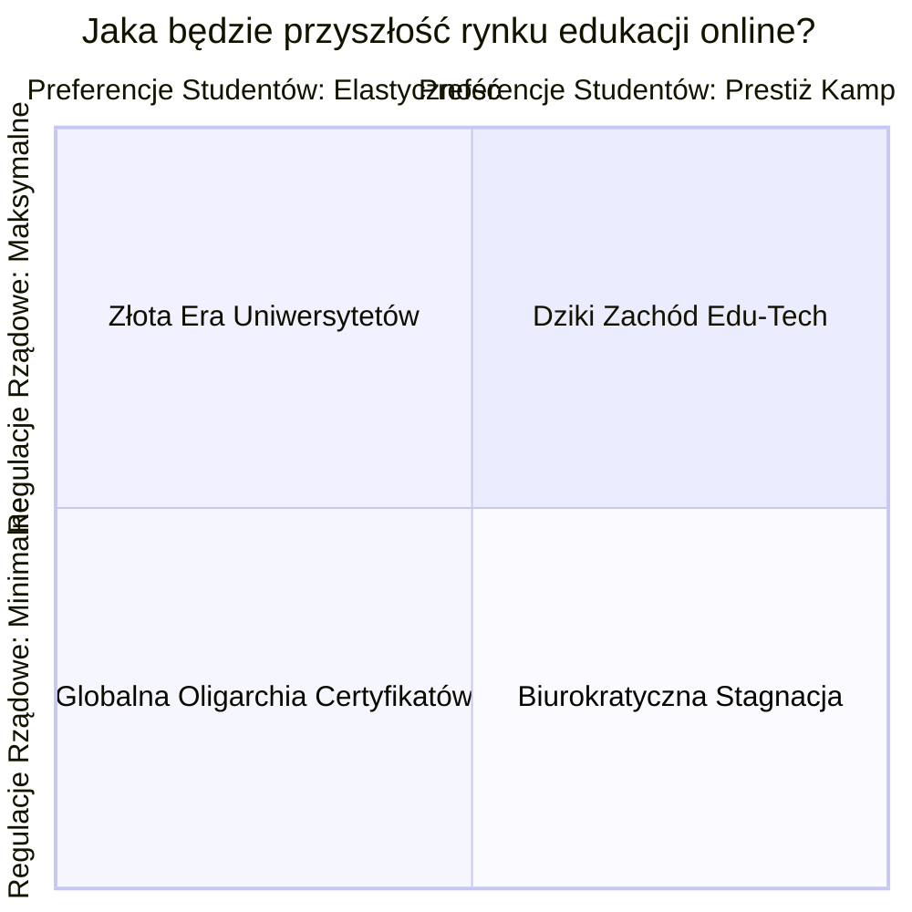

# 🧩 Klocek Koncepcyjny #9: Planowanie Scenariuszowe [MD]

## 📇 Karta Identyfikacyjna

| Cecha | Wartość |
| :--- | :--- |
| **ID** | KM-009 |
| **Alias** | Myślenie o Przyszłości, Analiza Scenariuszy, Planowanie Opcjonalne |
| **Typ** | Wzorzec Strategiczny (Strategic Pattern) |
| **Główne Zadanie** | Przygotowanie odpornej i elastycznej strategii na niepewną przyszłość |

## 💡 Opis Koncepcyjny

**Planowanie Scenariuszowe** to zdyscyplinowana metoda myślenia o przyszłości, spopularyzowana przez firmę Shell. Jej fundamentalne założenie jest proste, ale głębokie: **nie próbujemy przewidzieć przyszłości, ale przygotowujemy się na jej różne, wiarygodne wersje**. Zamiast tworzyć jedną, "oficjalną" prognozę, która prawie na pewno okaże się błędna, tworzymy kilka (zazwyczaj cztery) spójnych, wewnętrznie logicznych, ale fundamentalnie różnych opowieści o tym, jak może wyglądać świat za kilka lat.

Celem jest opracowanie strategii, która jest **odporna (robust)** lub nawet **anty-krucha (antifragile)** – czyli takiej, która nie tylko przetrwa w różnych scenariuszach, ale może nawet zyskać na niepewności. Metoda ta zmusza do identyfikacji kluczowych **sił napędowych (driving forces)** oraz **krytycznych niepewności (critical uncertainties)**, które kształtują naszą przyszłość, a następnie do przetestowania naszych planów w każdym z wykreowanych światów.

**Zastosowania:**

* **Planowanie strategiczne:** Tworzenie wieloletnich strategii dla firm, organizacji i instytucji.

* **Zarządzanie ryzykiem:** Identyfikacja "czarnych łabędzi" i nieoczywistych zagrożeń.

* **Testowanie odporności strategii ("Wind Tunneling"):** Sprawdzanie, jak obecny plan działania poradziłby sobie w radykalnie odmiennych warunkach.

* **Innowacje:** Identyfikacja nowych możliwości i nisz rynkowych, które mogą otworzyć się w różnych przyszłościach.

## ⚙️ Struktura Aktywacyjna

Aktywacja wzorca polega na zleceniu AI przeprowadzenia warsztatu scenariuszowego, który przekształca niepewność w ustrukturyzowane ramy do myślenia strategicznego.

### Szablon Promptu (Wersja Rozszerzona)

#### CENTRALNE PYTANIE STRATEGICZNE
{Jasno sformułowane pytanie o przyszłość, na które szukamy odpowiedzi, np. "Jaka powinna być nasza strategia rozwoju produktu na następne 5 lat w kontekście zmian na rynku AI?"}

#### ZADANIE
Zastosuj metodę Planowania Scenariuszowego, aby zbadać możliwe przyszłości i opracować odporne opcje strategiczne.

#### INSTRUKCJE WYKONANIA
Postępuj ściśle według następujących kroków:

KROK 1: Identyfikacja Sił Napędowych. Wypisz kluczowe trendy (społeczne, technologiczne, ekonomiczne, polityczne), które będą kształtować przyszłość w kontekście naszego pytania.

KROK 2: Wybór Krytycznych Niepewności. Z powyższej listy wybierz dwie siły napędowe, które są najważniejsze dla naszego pytania ORAZ najbardziej niepewne co do ich ostatecznego wyniku. To będą osie naszej macierzy.

KROK 3: Budowa Macierzy Scenariuszy. Stwórz macierz 2x2, używając wybranych niepewności jako osi. Opisz cztery wynikowe scenariusze. Nadaj każdemu z nich sugestywną, zapadającą w pamięć nazwę.

KROK 4: Testowanie Obecnej Strategii ("Wind Tunneling"). Krótko oceń, jak nasza obecna strategia poradziłaby sobie w każdym z czterech scenariuszy.

KROK 5: Identyfikacja Wczesnych Sygnałów Ostrzegawczych. Dla każdego scenariusza wskaż 1-2 wczesne sygnały (leading indicators), które moglibyśmy monitorować, aby wiedzieć, w kierunku której przyszłości zmierza świat.

## 🌊 Diagram Przepływu Myślowego

Klasyczną wizualizacją tego procesu jest macierz scenariuszy 2x2, która w przejrzysty sposób mapuje cztery możliwe przyszłości.



## 🚧 Anty-wzorce i Pułapki
Planowanie scenariuszowe to sztuka, a nie nauka ścisła. Oto najczęstsze błędy:

Prognozowanie Zamiast Planowania: Najgorszy błąd. Zespół zaczyna się kłócić o to, który ze scenariuszy jest "najbardziej prawdopodobny". To całkowicie mija się z celem. Wartość leży w przygotowaniu się na każdą z wiarygodnych opcji, a nie w obstawianiu jednej.

Niewłaściwe Osie: Wybór niepewności, które są albo mało istotne ("low impact"), albo wysoce przewidywalne ("low uncertainty"). Prowadzi to do stworzenia czterech nudnych i bardzo podobnych do siebie scenariuszy. Sztuką jest znalezienie osi o wysokim wpływie i wysokiej niepewności.

Scenariusz "Oficjalny" i Trzy Strachy na Lachy: Tworzenie jednego, pożądanego "oficjalnego" scenariusza i trzech ewidentnie negatywnych lub nieprawdopodobnych alternatyw. Aby metoda miała sens, wszystkie cztery scenariusze muszą być wewnętrznie spójne, wiarygodne i stanowiące realne wyzwanie dla strategii.

## ✅ Pytania Kontrolne Architekta
Zanim zaczniesz mapować przyszłość, zadaj sobie te pytania:

Czy moje dwie osie są naprawdę najważniejszymi i najbardziej niepewnymi siłami napędowymi? Czy nie ulegam pokusie, by wybrać te najłatwiejsze do opisania?

Czy każdy z moich czterech scenariuszy to wiarygodna, spójna i fundamentalnie inna historia o przyszłości? Czy uniknąłem pułapki tworzenia scenariusza "dobrego, złego i brzydkiego"?

Czy moja analiza prowadzi do opracowania elastycznych opcji strategicznych? Czy celem jest znalezienie ruchów, które są korzystne w wielu scenariuszach, czy tylko udowodnienie, że obecna strategia jest najlepsza?

## 🔗 Relacje i Kombinacje
Synergia:
KM-006 (Myślenie Systemowe): Jest to absolutnie niezbędny krok przed planowaniem scenariuszowym. Analiza systemowa pozwala zidentyfikować siły napędowe i niepewności, które stają się budulcem dla osi macierzy.

KM-005 (Myślenie Sześcioma Kapeluszami): Po stworzeniu czterech scenariuszy, każdy z nich można szczegółowo przeanalizować za pomocą Sześciu Kapeluszy, aby w pełni zrozumieć jego implikacje.

Alternatywa:
Jest to bezpośrednia alternatywa dla prostego, liniowego prognozowania i ekstrapolacji trendów. Planowanie scenariuszowe akceptuje i strukturyzuje niepewność, zamiast próbować ją ignorować lub eliminować.

💾 Reprezentacja Systemowa (JSON)

```json
{

  "id": "KM-009",

  "nazwa": "Planowanie Scenariuszowe (Scenario Planning)",

  "alias": ["Myślenie o Przyszłości", "Analiza Scenariuszy", "Planowanie Opcjonalne"],

  "typ": "Wzorzec Strategiczny (Strategic Pattern)",

  "cel": "Ustrukturyzowane przygotowanie się na niepewną przyszłość poprzez stworzenie i analizę kilku spójnych, wiarygodnych scenariuszy.",

  "zastosowania": [

    "planowanie strategiczne", 

    "zarządzanie ryzykiem", 

    "testowanie strategii", 

    "innowacje"

  ],

  "szablon_promptu_wersja": "2.0",

  "szablon_promptu": "### CENTRALNE PYTANIE STRATEGICZNE ###\n{pytanie_o_przyszlosc}\n\n### ZADANIE ###\nZastosuj metodę Planowania Scenariuszowego.\n\n### INSTRUKCJE WYKONANIA ###\n1. Identyfikacja Sił Napędowych.\n2. Wybór Krytycznych Niepewności.\n3. Budowa Macierzy Scenariuszy (2x2).\n4. Testowanie Obecnej Strategii.\n5. Identyfikacja Wczesnych Sygnałów Ostrzegawczych.",

  "relacje": {

    "wymaga_wcześniej": ["KM-006"],

    "wykorzystuje_w_środku": ["KM-005"],

    "alternatywa_dla": ["prognozowanie liniowe"]

  }

}
```
